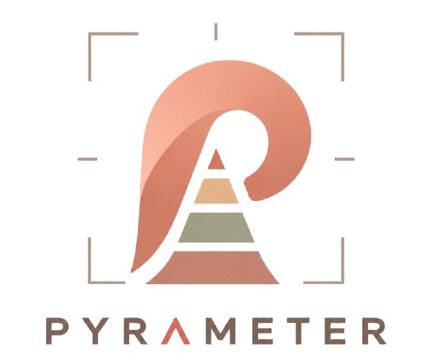

# Pyrameter

<p align="center">
    
</p>

<p align="center">
    Pyrameter is a PHPUnit extension that measures the shape of your test suite.
</p>

[](https://github.com/boundwize/pyrameter/releases)
[](https://github.com/boundwize/pyrameter/actions/workflows/ci.yml)
[](https://codecov.io/gh/boundwize/pyrameter)
[](https://github.com/phpstan/phpstan)
[](https://packagist.org/packages/boundwize/pyrameter)


It classifies tests as unit, functional, integration, or e2e based on what the test files consume, then reports whether your suite still matches your expected test pyramid.

Pyrameter does not trust test directories.

It does not assume infrastructure classes are always integration tests.

It does not scan production classes.

Instead, it looks for configured heavy usage in test files:

- no heavy usage => unit
- framework test runtime => functional
- database or external system usage => integration
- browser driver usage => e2e

```txt
Pyrameter
=========

Shape: Integration Mountain
Result: Violated ⚠

Kind          Tests   Actual   Target      Status
Unit             39    65.0%   >= 70.0%    ✗
Functional       10    16.7%   <= 20.0%    ✓
Integration       9    15.0%   <=  8.0%    ✗
E2E               1     1.7%   <=  2.0%    ✓
Unknown           1     1.7%   <=  2.0%    ✓

Total: 60 tests

Your suite is getting heavier.
```

## Installation

```bash
composer require --dev boundwize/pyrameter
```

## Register PHPUnit extension

```xml
<extensions>
    <bootstrap class="Pyrameter\Extension">
        <parameter name="config" value="pyrameter.php"/>
    </bootstrap>
</extensions>
```

If the `config` parameter is omitted, Pyrameter looks for `pyrameter.php` in the current working directory. If the file does not exist, Pyrameter uses its default configuration.

## Configure

Create `pyrameter.php`:

```php
<?php

declare(strict_types=1);

use Pyrameter\Config\PyrameterConfig;
use Pyrameter\TestKind;

return PyrameterConfig::create()
    ->targetShape(
        unit: ['min' => 40],
    );
```

Missing kinds default to `['min' => 0, 'max' => 100]`, so you can start with only the one target you care about.

Add usage rules when you want Pyrameter to classify heavier tests:

```php
return PyrameterConfig::create()
    ->usesClass(PDO::class, TestKind::Integration)
    ->usesNamespace('Doctrine\DBAL\\', TestKind::Integration)
    ->usesNamespace('Symfony\Bundle\FrameworkBundle\Test\\', TestKind::Functional)
    ->usesNamespace('Symfony\Component\Panther\\', TestKind::E2E)
    ->usesNamespace('Facebook\WebDriver\\', TestKind::E2E)

    ->targetShape(
        unit: ['min' => 70],
        functional: ['max' => 18],
        integration: ['max' => 8],
        e2e: ['max' => 2],
        unknown: ['max' => 2],
    );
```

Each target is a percentage range. Missing `min` means `0`; missing `max` means `100`.

By default, Pyrameter is report-only: it prints target violations but does not change PHPUnit's exit code.

To fail the PHPUnit process after a target violation:

```php
return PyrameterConfig::create()
    ->targetShape(
        unit: ['min' => 70],
        integration: ['max' => 8],
    )
    ->failOnViolation();
```

Pyrameter classifies tests by static usage rules in test files. It measures suite shape; it does not prove perfect test taxonomy.
